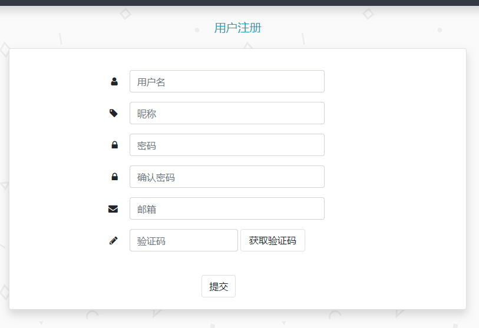
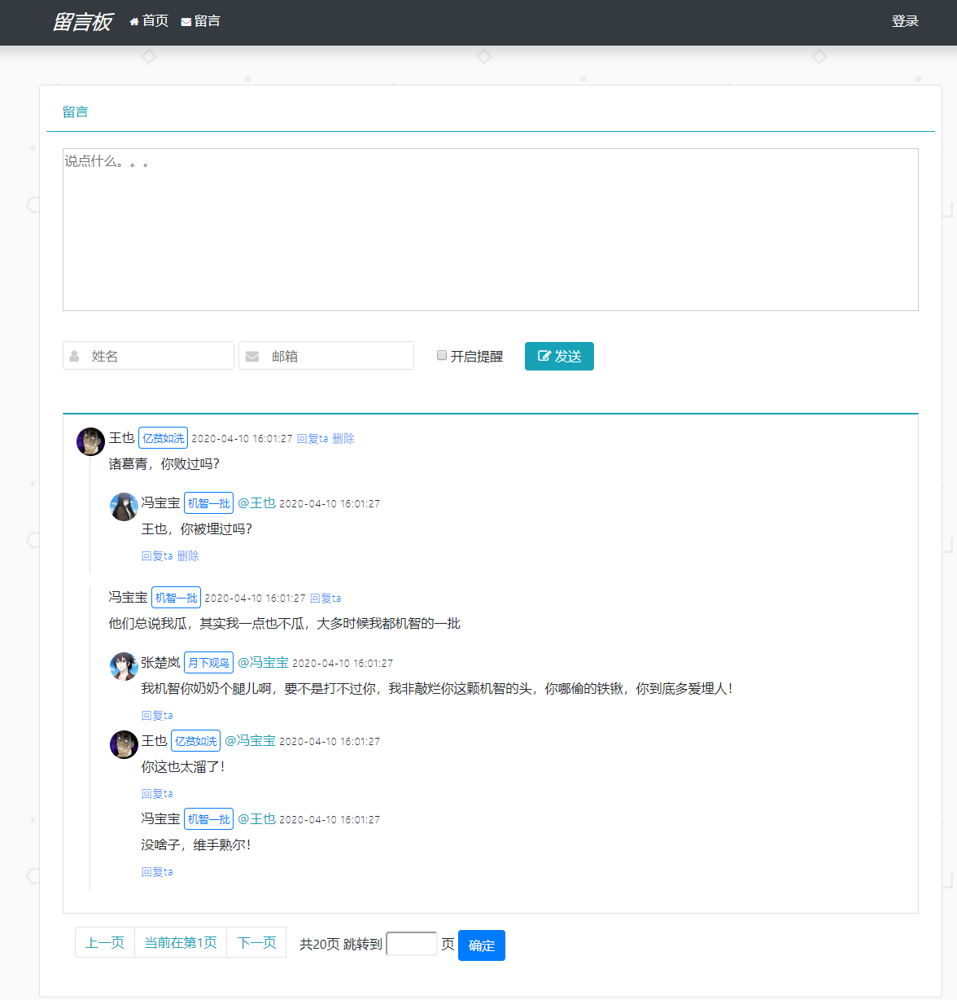
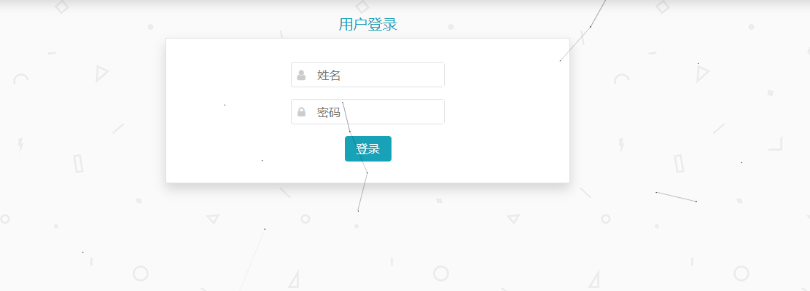

### 项目采用的技术

* 业务层和业务层是基于Springboot整合的SSM
* 持久层采用的Mybatis-Plus，连接池采用的是Druid
* 模板引擎采用的是Thymeleaf。
* 前端框架采用的是Bootstrap

### 项目功能

* 注册：可以通过邮箱发送验证码进行验证注册。
* 防盗链：未登录状态无法查看留言
* 留言提醒：留言可以选择消息提醒功能，开启后每当有评论，则会通过邮件的方式提醒。
* 网易云插件：可以在网页内播放音乐

### 项目代码

* github链接：[代码](https://github.com/jiang4869/message)

* 邮件功能需要更改 `/src/main/java/resources/application.properties` 文件中的

  * ```properties
    spring.mail.username
    spring.mail.password	
    ```

* 数据库需要更改 `/src/main/java/resources/application.yml1 文件中的

  ```
  spring:
    datasource:
      username: username
      password: password
      url: url
  ```

* 数据库文件在 `/src/main/java/resouces/message.sql`

### 项目效果







